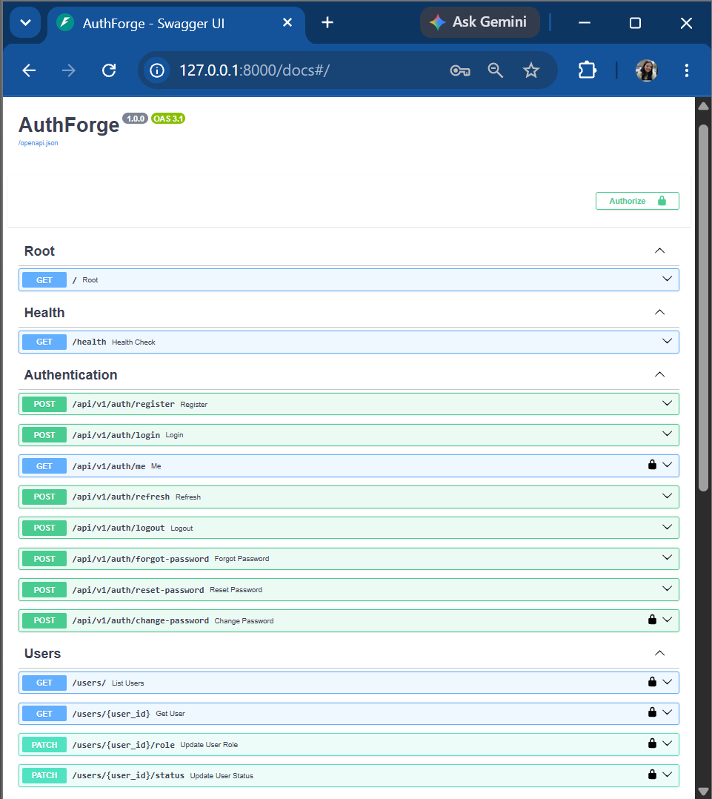

# AuthForge

<p align="center">

Production-grade Authentication & Authorization Microservice built with FastAPI, PostgreSQL, and Clean Architecture.

</p>

<p align="center">


</p>

---

## Overview

AuthForge is a production-ready authentication and authorization microservice built with FastAPI following Clean Architecture principles. It provides secure user authentication, JWT-based authorization, role-based access control (RBAC), refresh token rotation, password recovery, and user management through a modular and maintainable backend architecture.

The project is designed as a reusable authentication service that can be integrated into modern web applications or microservice-based systems. Alongside authentication workflows, it demonstrates engineering practices such as layered architecture, repository and service patterns, dependency injection, automated testing, database migrations, containerization, and continuous integration.

---

## Live Demo

- API: https://authforge-ovjf.onrender.com
- Swagger UI: https://authforge-ovjf.onrender.com/docs

---

## Table of Contents

- [Features](#features)
- [Technology Stack](#technology-stack)
- [Project Structure](#project-structure)
- [API Reference](#api-reference)
- [Security Features](#security-features)
- [Engineering Decisions](#engineering-decisions)
- [Testing](#testing)
- [Running Locally](#running-locally)
- [Docker](#docker)
- [Continuous Integration](#continuous-integration)
- [Roadmap](#roadmap)
- [Contributing](#contributing)
- [License](#license)
- [Author](#author)

---

# Features

## Authentication

- User registration
- User login using email or username
- JWT access token generation
- Refresh token rotation
- Secure logout with refresh token revocation

## Authorization

- Role-Based Access Control (RBAC)
- Role-protected API endpoints
- Admin and User role management

## Password Management

- Forgot password workflow
- Password reset using secure reset tokens
- Change password for authenticated users
- Single-use password reset tokens with expiration

## User Management

- Retrieve authenticated user profile
- List registered users
- Update user roles
- Activate or deactivate user accounts

## Security

- Password hashing using bcrypt
- JWT authentication
- Refresh token revocation
- Email enumeration protection
- Centralized exception handling
- Structured application logging

## Developer Experience

- Clean Architecture
- Repository Pattern
- Service Layer
- Dependency Injection
- Alembic database migrations
- Docker support
- GitHub Actions CI
- Ruff linting
- Black formatting
- Automated testing using Pytest

---

# Technology Stack

| Category | Technology |
|-----------|------------|
| Backend Framework | FastAPI |
| Programming Language | Python 3.11 |
| Database | PostgreSQL |
| ORM | SQLAlchemy 2.0 |
| Data Validation | Pydantic v2 |
| Authentication | JWT (Access & Refresh Tokens) |
| Password Hashing | bcrypt |
| Database Migrations | Alembic |
| Testing | Pytest |
| Code Formatting | Black |
| Linting | Ruff |
| Containerization | Docker |
| Continuous Integration | GitHub Actions |

---

# Project Structure

```text
AuthForge
│
├── alembic/                     # Database migrations
│
├── app/
│   ├── core/                    # Configuration, security, JWT, logging
│   ├── db/                      # Database session and models
│   ├── modules/
│   │   ├── auth/                # Authentication module
│   │   ├── users/               # User management
│   │   └── roles/               # Role management
│   └── shared/                  # Shared dependencies
│
├── scripts/                     # Utility scripts
├── tests/                       # Automated tests
├── .github/workflows/           # GitHub Actions
│
├── Dockerfile
├── docker-compose.yml
├── requirements.txt
├── README.md
└── .env.example
```

The project follows a modular architecture where each domain is organized independently, making it easier to extend, maintain, and test.

---

# API Reference

The API follows REST principles and exposes endpoints for authentication, authorization, password management, and user administration.

| Method | Endpoint | Description |
|---------|----------|-------------|
| POST | `/api/v1/auth/register` | Register a new user |
| POST | `/api/v1/auth/login` | Authenticate a user |
| GET | `/api/v1/auth/me` | Retrieve the authenticated user |
| POST | `/api/v1/auth/refresh` | Generate new access and refresh tokens |
| POST | `/api/v1/auth/logout` | Revoke refresh token |
| POST | `/api/v1/auth/forgot-password` | Generate a password reset token |
| POST | `/api/v1/auth/reset-password` | Reset password using a valid reset token |
| POST | `/api/v1/auth/change-password` | Change the current user's password |
| GET | `/users/` | Retrieve all users (Admin) |
| PATCH | `/users/{user_id}/role` | Update a user's role (Admin) |
| PATCH | `/users/{user_id}/status` | Activate or deactivate a user (Admin) |

---

## Interactive API Documentation

Swagger UI is available when the application is running.

```text
http://localhost:8000/docs
```

After deployment, replace the localhost URL with the production endpoint.

<!-- Replace with a screenshot after deployment -->

<!--

-->

OpenAPI Specification:

```text
http://localhost:8000/openapi.json
```

---

# Security Features

Security is a core design objective of AuthForge. The authentication workflow incorporates multiple defensive mechanisms commonly used in production backend systems to protect user credentials, authentication tokens, and privileged operations.

### Authentication Security

- Passwords are securely hashed using **bcrypt** before being stored in the database.
- JWT Access Tokens are issued for stateless authentication.
- Refresh Tokens are persisted in the database and validated before issuing new access tokens.
- Refresh Token Rotation prevents reuse of previously issued refresh tokens.
- Refresh Tokens can be revoked during logout.

### Password Management

- Password reset requests generate cryptographically secure, single-use reset tokens.
- Reset tokens automatically expire after a configurable duration.
- Used reset tokens cannot be reused.
- Password changes require verification of the current password.

### Authorization

- Role-Based Access Control (RBAC) restricts privileged operations.
- Administrative endpoints are protected using role-based authorization.
- User status (active/inactive) is verified before authentication.

### API Protection

- Centralized exception handling prevents inconsistent API responses.
- Password recovery prevents email enumeration attacks.
- Sensitive credentials are managed using environment variables.
- Authentication logic is isolated from API routes through a dedicated service layer.

---

# Engineering Decisions

AuthForge follows engineering practices commonly adopted in production backend systems. Each architectural decision was made to improve maintainability, scalability, and security.

| Decision | Reason |
|-----------|--------|
| Clean Architecture | Separates business logic from framework-specific implementation details. |
| Service Layer | Centralizes authentication workflows and business rules. |
| Repository Pattern | Decouples persistence logic from application logic. |
| Dependency Injection | Simplifies testing and improves modularity. |
| JWT Authentication | Enables scalable stateless authentication. |
| Refresh Token Rotation | Reduces the impact of compromised refresh tokens. |
| Role-Based Access Control | Provides centralized authorization for privileged operations. |
| Alembic Migrations | Maintains version-controlled database schema evolution. |
| Docker | Ensures consistent execution across development and deployment environments. |
| GitHub Actions | Automatically validates formatting and code quality on every push. |

---

# Testing

AuthForge includes automated tests covering the core authentication and authorization workflows.

### Authentication

- User Registration
- User Login
- Invalid Login Handling
- JWT Access Token Generation
- Refresh Token Rotation
- Secure Logout

### Password Management

- Forgot Password
- Password Reset
- Change Password
- Invalid Reset Token Handling

### Authorization

- Role-Based Access Control (RBAC)
- Protected Route Access
- User Role Validation

### Quality Assurance

The project enforces automated quality checks using:

- Pytest
- Ruff
- Black
- GitHub Actions Continuous Integration

Run the complete test suite:

```bash
pytest -v
```

Run the linter:

```bash
ruff check .
```

Verify code formatting:

```bash
black --check .
```

---

# Running Locally

## Prerequisites

Ensure the following are installed on your system:

- Python 3.11+
- PostgreSQL
- Git
- Docker (optional)

---

## Clone the Repository

```bash
git clone https://github.com/aaryaa135/AuthForge.git
cd AuthForge
```

---

## Create a Virtual Environment

```bash
python -m venv .venv
```

Activate the environment.

### Windows

```bash
.venv\Scripts\activate
```

### Linux / macOS

```bash
source .venv/bin/activate
```

---

## Install Dependencies

```bash
pip install -r requirements.txt
```

---

## Configure Environment Variables

Copy the example configuration:

```bash
cp .env.example .env
```

Update the required environment variables before running the application.

---

## Run Database Migrations

```bash
alembic upgrade head
```

---

## Start the Server

```bash
uvicorn app.main:app --reload
```

The API will be available at:

```text
http://localhost:8000
```

Interactive API Documentation:

```text
http://localhost:8000/docs
```

OpenAPI Specification:

```text
http://localhost:8000/openapi.json
```

---

# Docker

AuthForge supports containerized development and deployment using Docker.

## Build the Image

```bash
docker build -t authforge .
```

## Run the Container

```bash
docker run -p 8000:8000 authforge
```

Alternatively, use Docker Compose:

```bash
docker compose up --build
```

---

# Continuous Integration

Every push and pull request is automatically validated using GitHub Actions.

Current pipeline includes:

- Ruff static analysis
- Black formatting verification

Future pipeline improvements include:

- PostgreSQL service for integration testing
- Automated deployment
- Security scanning
- Test coverage reporting

---

# Roadmap

The following enhancements are planned for future releases.

### Authentication

- Email verification
- Multi-Factor Authentication (MFA)
- OAuth 2.0 (Google & GitHub)
- Session management dashboard

### Security

- Redis-based token blacklist
- API rate limiting
- Audit logging
- Security monitoring

### Infrastructure

- Kubernetes deployment
- Terraform infrastructure
- Observability with Prometheus & Grafana
- Production monitoring

---

# Contributing

Contributions are welcome.

If you would like to contribute:

1. Fork the repository.
2. Create a feature branch.
3. Commit your changes.
4. Push the branch.
5. Open a Pull Request.

Before submitting a Pull Request, ensure that:

- All tests pass.
- Ruff reports no issues.
- Black formatting checks pass.
- New functionality includes appropriate tests.

---

# License

This project is licensed under the MIT License.

See the `LICENSE` file for details.

---

# Author

**Aarya Gupta**

Computer Science Engineering Student

- GitHub: https://github.com/aaryaa135
- LinkedIn: https://www.linkedin.com/in/aarya--gupta/

---

If you found this project useful, consider giving it a ⭐ on GitHub.
